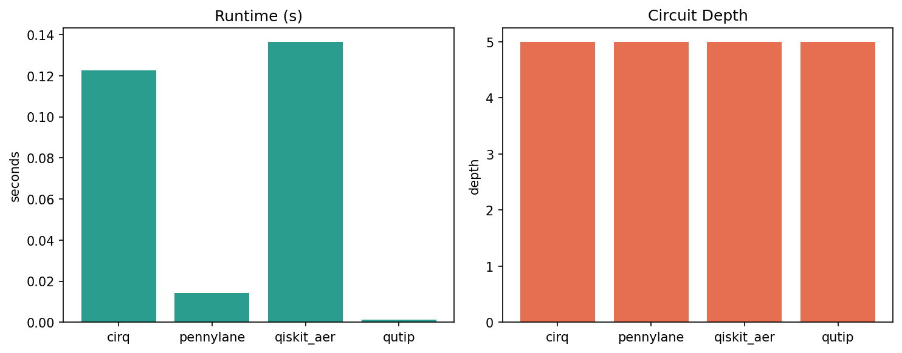
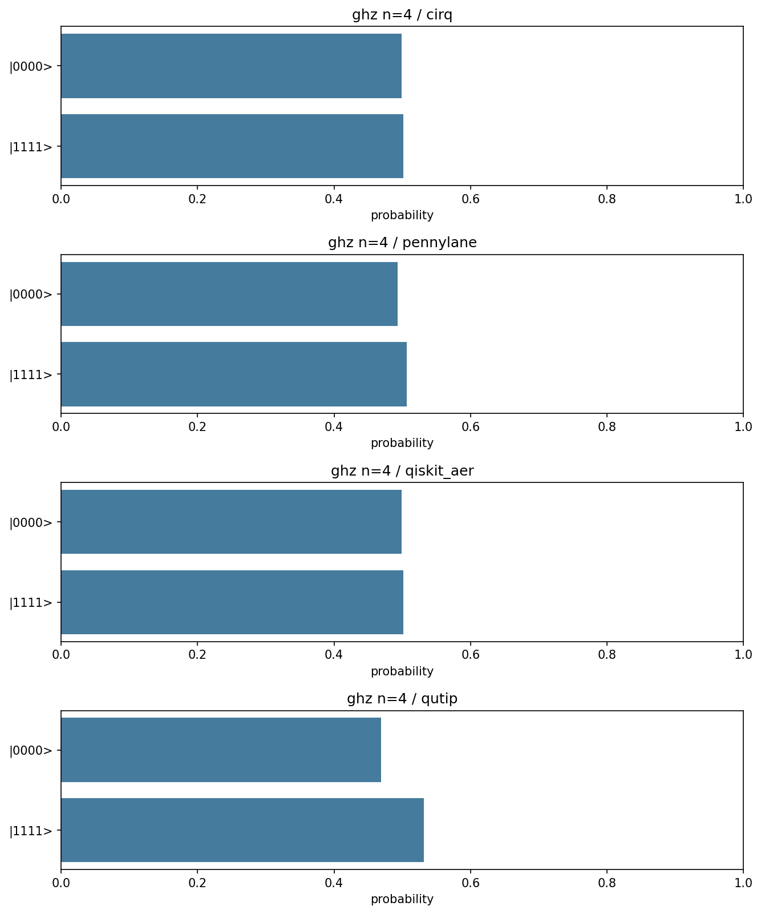
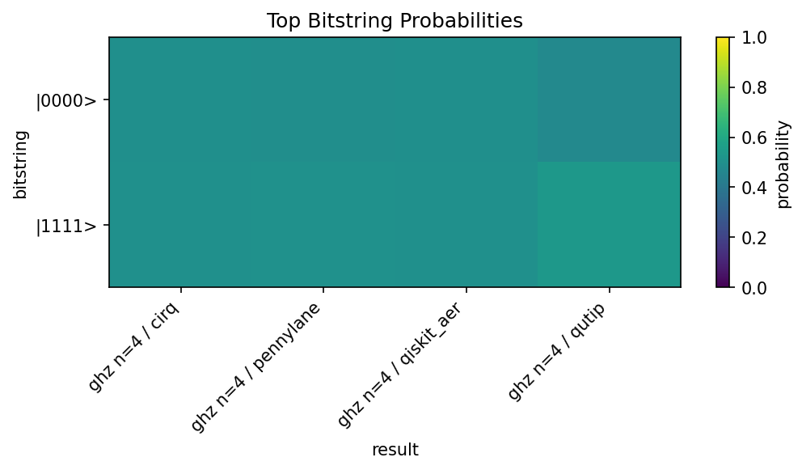
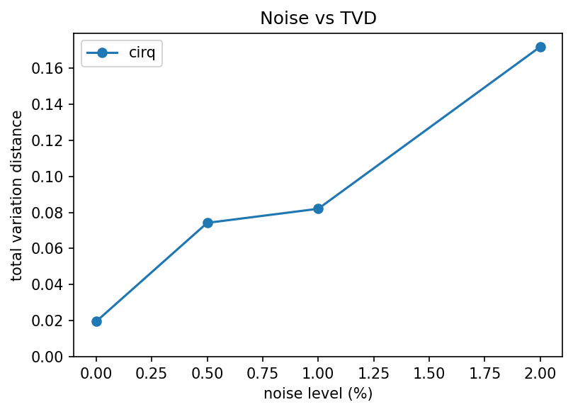
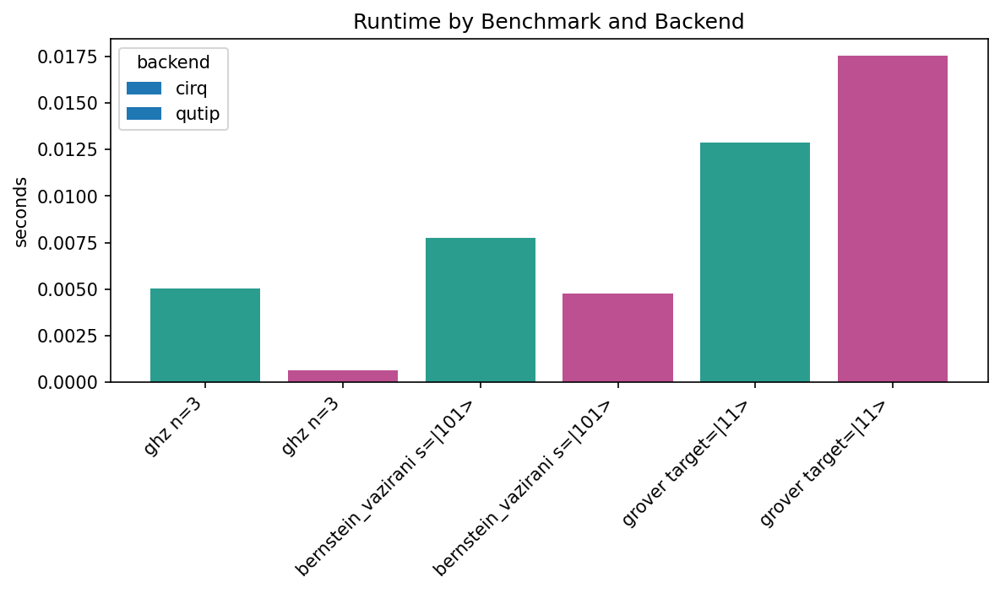

# Results

This page records small, reproducible reference outputs for `quantum-backend-bench`.
The goal is to demonstrate the reporting workflow and the shape of the generated
plots, not to publish universal backend rankings.

The measurements below were generated on May 7, 2026 in a Linux Codespaces-style
environment with Python 3.12.1. Runtime values are local and environment-dependent;
use them as examples of the package output format rather than fixed performance
claims.

## Reproduce These Outputs

The plotted assets live under `docs/pages/assets/` so they can be rendered both on
GitHub and on the GitHub Pages site.

```bash
MPLBACKEND=Agg MPLCONFIGDIR=/tmp/matplotlib \
python -m quantum_backend_bench.cli compare ghz \
  --backends cirq pennylane qiskit_aer qutip \
  --n-qubits 4 \
  --shots 256 \
  --repeats 3 \
  --save-json docs/pages/assets/ghz_backend_comparison.json \
  --save-csv docs/pages/assets/ghz_backend_comparison.csv \
  --save-plot docs/pages/assets/ghz_runtime_depth.png \
  --save-distribution docs/pages/assets/ghz_distribution.png \
  --save-heatmap docs/pages/assets/ghz_heatmap.png \
  --summary
```

```bash
MPLBACKEND=Agg MPLCONFIGDIR=/tmp/matplotlib \
python -m quantum_backend_bench.cli noise-sweep ghz \
  --backend cirq \
  --n-qubits 4 \
  --shots 256 \
  --noise-levels 0 0.005 0.01 0.02 \
  --save-json docs/pages/assets/ghz_noise_sweep.json \
  --save-quality-plot docs/pages/assets/ghz_noise_quality.png \
  --summary
```

```bash
MPLBACKEND=Agg MPLCONFIGDIR=/tmp/matplotlib \
python -m quantum_backend_bench.cli suite smoke \
  --backends cirq qutip \
  --shots 128 \
  --repeats 2 \
  --save-json docs/pages/assets/smoke_suite_results.json \
  --save-suite-plot docs/pages/assets/smoke_suite_runtime.png \
  --summary
```

## GHZ Backend Comparison

The GHZ comparison runs the same four-qubit entanglement benchmark across several
installed local simulators. All backends produce the same circuit structure; runtime
differences reflect local SDK overhead, simulator implementation, sampling mode, and
the current machine.

| Case | Backend | Runtime (s) | Depth | Gates | TVD | Success |
|---|---:|---:|---:|---:|---:|---:|
| ghz n=4 | cirq | 0.122665 | 5 | 4 | 0.001302 | n/a |
| ghz n=4 | pennylane | 0.014281 | 5 | 4 | 0.006510 | n/a |
| ghz n=4 | qiskit_aer | 0.136513 | 5 | 4 | 0.001302 | n/a |
| ghz n=4 | qutip | 0.001380 | 5 | 4 | 0.031250 | n/a |







Raw data:
[JSON](docs/pages/assets/ghz_backend_comparison.json) and
[CSV](docs/pages/assets/ghz_backend_comparison.csv).

## Noise Sweep

The noise sweep wraps the GHZ benchmark with Cirq depolarizing-noise injection.
The total variation distance increases as the injected noise level rises, which is
the expected qualitative behaviour for this reference workload.

| Case | Backend | Runtime (s) | Depth | Gates | TVD | Success |
|---|---:|---:|---:|---:|---:|---:|
| ghz_noise p=0.0 | cirq | 0.004179 | 5 | 4 | 0.019531 | n/a |
| ghz_noise p=0.005 | cirq | 5.377992 | 5 | 4 | 0.074219 | n/a |
| ghz_noise p=0.01 | cirq | 4.227480 | 5 | 4 | 0.082031 | n/a |
| ghz_noise p=0.02 | cirq | 3.836664 | 5 | 4 | 0.171875 | n/a |



Raw data:
[JSON](docs/pages/assets/ghz_noise_sweep.json).

## Smoke Suite

The smoke suite covers a compact multi-benchmark run. It is useful as a quick
sanity check for result tables, suite plots, and backend capability differences.

| Case | Backend | Runtime (s) | Depth | Gates | TVD | Success |
|---|---:|---:|---:|---:|---:|---:|
| ghz n=3 | cirq | 0.005039 | 4 | 3 | 0.023438 | n/a |
| ghz n=3 | qutip | 0.000607 | 4 | 3 | 0.109375 | n/a |
| bernstein_vazirani s=\|101> | cirq | 0.007739 | 6 | 10 | 0.000000 | 1.000000 |
| bernstein_vazirani s=\|101> | qutip | 0.004737 | 6 | 10 | 0.000000 | 1.000000 |
| grover target=\|11> | cirq | 0.012883 | 14 | 22 | n/a | 0.261719 |
| grover target=\|11> | qutip | 0.017563 | 14 | 22 | n/a | 0.320312 |



Raw data:
[JSON](docs/pages/assets/smoke_suite_results.json).

## Interpretation Notes

- Runtime comparisons are only meaningful for the local environment where they were
  measured.
- Circuit depth and gate-count metrics are structural checks and should be more
  stable than wall-clock timing.
- Total variation distance is computed against the expected distribution where the
  benchmark defines one.
- Success probability is reported only for benchmarks with a meaningful target
  state or oracle success condition.
- Noise-injected cases can be much slower than noiseless cases because the simulator
  may switch to a density-matrix or noisy-channel execution path.
