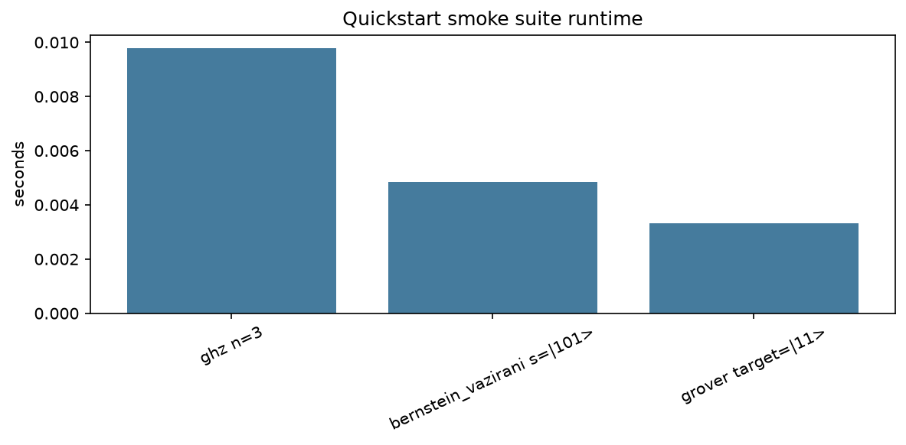
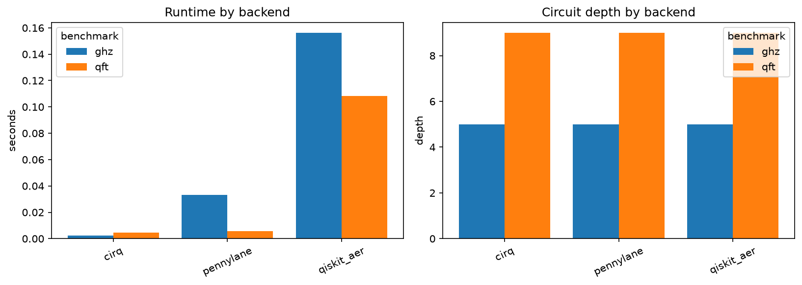
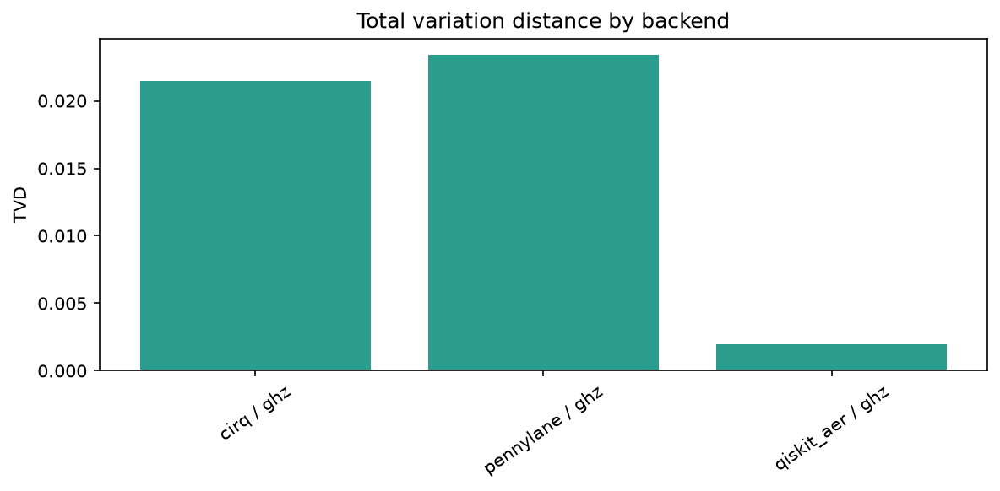
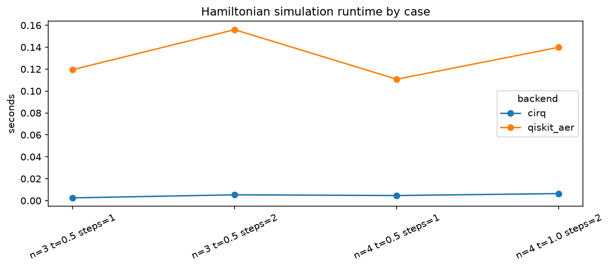
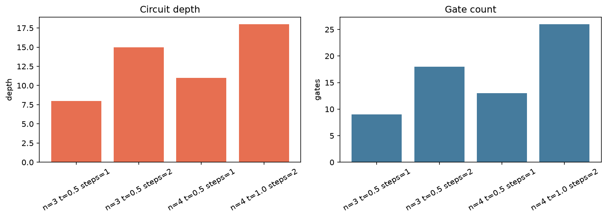
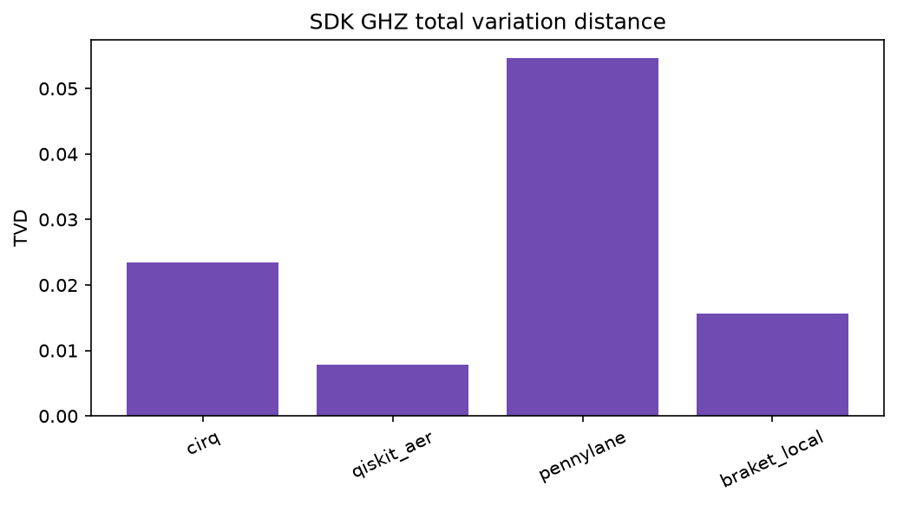

# Results

This page is generated from executed tutorial notebook artifacts. The source notebooks live in `../notebooks/`, and their saved JSON/CSV outputs are copied from `../artifacts/notebooks/` into `pages/assets/notebooks/` for the documentation site.

The numbers demonstrate result shape, plotting, and qualitative benchmark behavior. Runtime values are local-machine dependent and should not be read as universal backend rankings. The builder prefers fresh files under `../artifacts/notebooks/` and falls back to the committed assets under `pages/assets/notebooks/` for clean documentation builds.

## Reproduce These Outputs

Run the notebooks in order, or execute their code cells with a notebook runner, then rebuild this page:

```bash
python docs/pages/build_notebook_results.py
python docs/pages/build_site.py
```

The builder expects these notebook-generated files under `../artifacts/notebooks/`: `quickstart_cirq_smoke.json`, `local_simulator_comparison.json`, `hamiltonian_case_study.json`, and the four `sdk_*_workflow.json` files.

## Quickstart Cirq Smoke Suite

Generated by `01_quickstart_cirq.ipynb`. This compact run exercises GHZ, Bernstein-Vazirani, and Grover through the local Cirq backend.

| Case | Backend | Runtime (s) | Depth | Gates | TVD | Success |
|---|---:|---:|---:|---:|---:|---:|
| ghz n=3 | cirq | 0.009789 | 4 | 3 | 0.000000 | n/a |
| bernstein_vazirani s=\|101> | cirq | 0.004837 | 6 | 10 | 0.000000 | 1.000000 |
| grover target=\|11> | cirq | 0.003320 | 8 | 12 | n/a | 1.000000 |



Raw notebook artifacts: [JSON](pages/assets/notebooks/quickstart_cirq_smoke.json) and [CSV](pages/assets/notebooks/quickstart_cirq_smoke.csv).

## Local Simulator Comparison

Generated by `02_compare_local_simulators.ipynb`. The notebook compares installed local simulator SDKs on GHZ and QFT using the same package runner.

| Case | Backend | Runtime (s) | Depth | Gates | TVD | Success |
|---|---:|---:|---:|---:|---:|---:|
| ghz n=4 | cirq | 0.002197 | 5 | 4 | 0.021484 | n/a |
| ghz n=4 | pennylane | 0.033108 | 5 | 4 | 0.023438 | n/a |
| ghz n=4 | qiskit_aer | 0.156260 | 5 | 4 | 0.001953 | n/a |
| qft n=4 | cirq | 0.004524 | 9 | 12 | n/a | n/a |
| qft n=4 | pennylane | 0.005652 | 9 | 12 | n/a | n/a |
| qft n=4 | qiskit_aer | 0.108136 | 9 | 12 | n/a | n/a |





Raw notebook artifacts: [JSON](pages/assets/notebooks/local_simulator_comparison.json) and [CSV](pages/assets/notebooks/local_simulator_comparison.csv).

## Hamiltonian Simulation Case Study

Generated by `03_hamiltonian_simulation_case_study.ipynb`. The notebook varies qubits, evolution time, and Trotter steps for a small Ising-style Hamiltonian simulation study.

| Case | Backend | Runtime (s) | Depth | Gates | TVD | Success |
|---|---:|---:|---:|---:|---:|---:|
| hamiltonian_sim n=3 | cirq | 0.002495 | 8 | 9 | n/a | n/a |
| hamiltonian_sim n=3 | qiskit_aer | 0.119476 | 8 | 9 | n/a | n/a |
| hamiltonian_sim n=3 | cirq | 0.005312 | 15 | 18 | n/a | n/a |
| hamiltonian_sim n=3 | qiskit_aer | 0.156005 | 15 | 18 | n/a | n/a |
| hamiltonian_sim n=4 | cirq | 0.004657 | 11 | 13 | n/a | n/a |
| hamiltonian_sim n=4 | qiskit_aer | 0.110775 | 11 | 13 | n/a | n/a |
| hamiltonian_sim n=4 | cirq | 0.006416 | 18 | 26 | n/a | n/a |
| hamiltonian_sim n=4 | qiskit_aer | 0.139921 | 18 | 26 | n/a | n/a |





Raw notebook artifacts: [JSON](pages/assets/notebooks/hamiltonian_case_study.json) and [CSV](pages/assets/notebooks/hamiltonian_case_study.csv).

## SDK Workflow Notebooks

Generated by `04_compare_sdk_workflows.ipynb`. This notebook applies the same GHZ export, local execution, artifact, and verification workflow across SDK adapters.

| Case | Backend | Runtime (s) | Depth | Gates | TVD | Success |
|---|---:|---:|---:|---:|---:|---:|
| ghz n=3 | cirq | 0.002627 | 4 | 3 | 0.023438 | n/a |
| ghz n=3 | qiskit_aer | 0.178327 | 4 | 3 | 0.007812 | n/a |
| ghz n=3 | pennylane | 0.006724 | 4 | 3 | 0.054688 | n/a |
| ghz n=3 | braket_local | 0.038583 | 4 | 3 | 0.015625 | n/a |



Raw notebook artifacts: [sdk_cirq_workflow.json](pages/assets/notebooks/sdk_cirq_workflow.json), [sdk_qiskit_workflow.json](pages/assets/notebooks/sdk_qiskit_workflow.json), [sdk_pennylane_workflow.json](pages/assets/notebooks/sdk_pennylane_workflow.json), [sdk_braket_workflow.json](pages/assets/notebooks/sdk_braket_workflow.json).

## Interpretation Notes

- Runtime comparisons are only meaningful for the local environment where the notebooks were executed.
- Circuit depth and gate-count metrics are structural checks and should be more stable than wall-clock timing.
- Total variation distance is computed against the expected distribution where the benchmark defines one.
- Success probability is reported only for benchmarks with a meaningful target state or oracle success condition.
- Noise-heavy examples remain in the examples workflow rather than this notebook-derived page because noisy simulation can be much slower.
